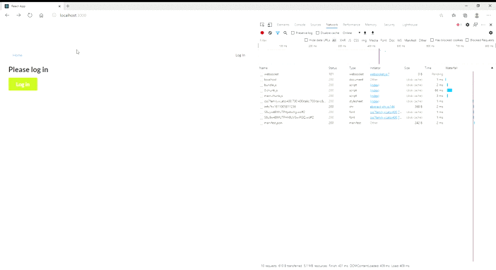
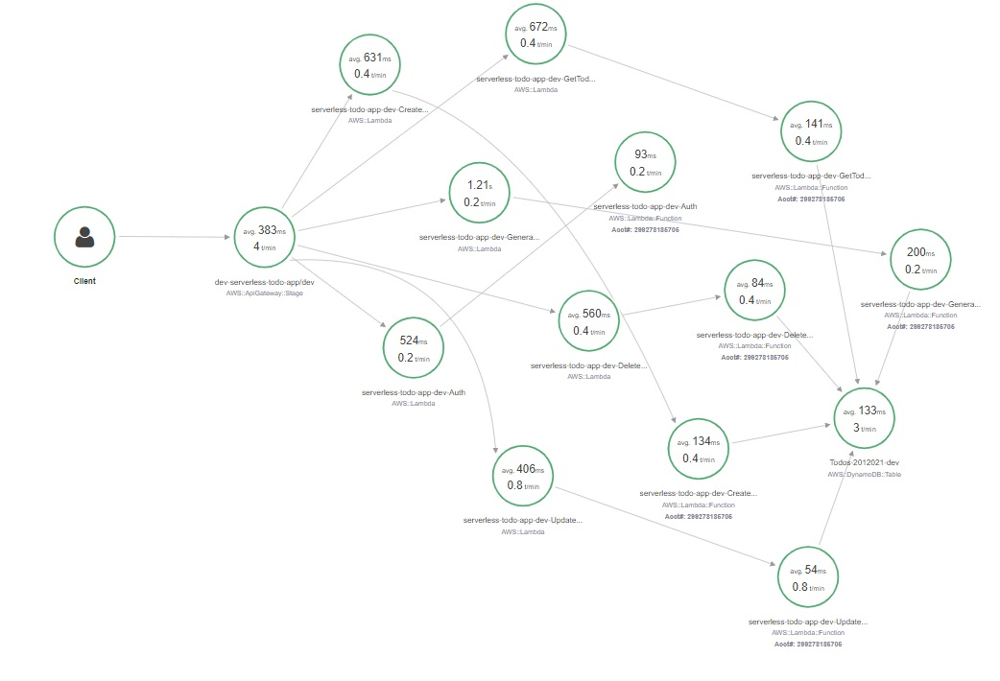

Table of Contents
=================
   * [Functionality of the application](#functionality-of-the-application)
   * [Demo](#demo)
   * [Aws-Xray Map](#aws-xray-map)
   * [TODO items](#todo-items)
      * [Technologies, services and concepts used](#technologies-services-and-concepts-used)
   * [Frontend](#frontend)
   * [How to run the application](#how-to-run-the-application)
      * [Backend](#backend)
      * [Frontend](#frontend)
   * [What to do](#what-to-do)

# Functionality of the application

This application will allow creating/removing/updating/fetching TODO items. Each TODO item can optionally have an attachment image. Each user only has access to TODO items that he/she has created.


The main project purpose was to complete [a initial project](https://github.com/udacity/cloud-developer/tree/master/course-04/project/c4-final-project-starter-code) with some best practices.

## Technologies, services and concepts used
1. AWS Lambda as Serverless Compute Service 
2. AWS Simple Storage Service (S3) as File Storage
3. AWS DynamoDB - NoSQL Database
4. AWS Api Gateway
5. AWS CloudFormation
6. AWS Xray
7. Auth0 as authentication
8. Serverless Framework
9. React


# Demo


# AWS Xray Map


# TODO items

The application should store TODO items, and each TODO item contains the following fields:

* `todoId` (string) - a unique id for an item
* `createdAt` (string) - date and time when an item was created
* `name` (string) - name of a TODO item (e.g. "Change a light bulb")
* `dueDate` (string) - date and time by which an item should be completed
* `done` (boolean) - true if an item was completed, false otherwise
* `attachmentUrl` (string) (optional) - a URL pointing to an image attached to a TODO item

You might also store an id of a user who created a TODO item.

# Frontend

The `client` folder contains a web application that can use the API that should be developed in the project.

It needs to API endpoint and Auth0 configuration:

```ts
const apiId = ''
const apiRegion = ''
export const apiEndpoint = `https://${apiId}.execute-api.${apiRegion}.amazonaws.com/dev`

export const authConfig = {
  domain: '...',    // Domain from Auth0
  clientId: '...',  // Client id from an Auth0 application
  callbackUrl: 'http://localhost:3000/callback'
}
```

# How to run the application

## Backend

To deploy an application run the following commands:

```
cd backend
npm install
sls deploy -v
```

## Frontend

To run a client application first edit the `client/src/config.ts` file to set correct parameters. And then run the following commands:

```
cd client
npm install
npm run start
```

This should start a development server with the React application that will interact with the serverless TODO application.

# What to do
- Implement a new endpoint that allows sending full-text search requests to Elasticsearch
- Implementation pagination support to work around a DynamoDB limitation up to 1 MB
- Add an ability to sort TODOs by due date or priority
- Use middy middleware to increase code re-use
- Performance improvements: Reduce the cold start with plugin
- Each function has its own set of permissions
- Decrease the size of dependencies and increase performance of functions
- Canary Deployment